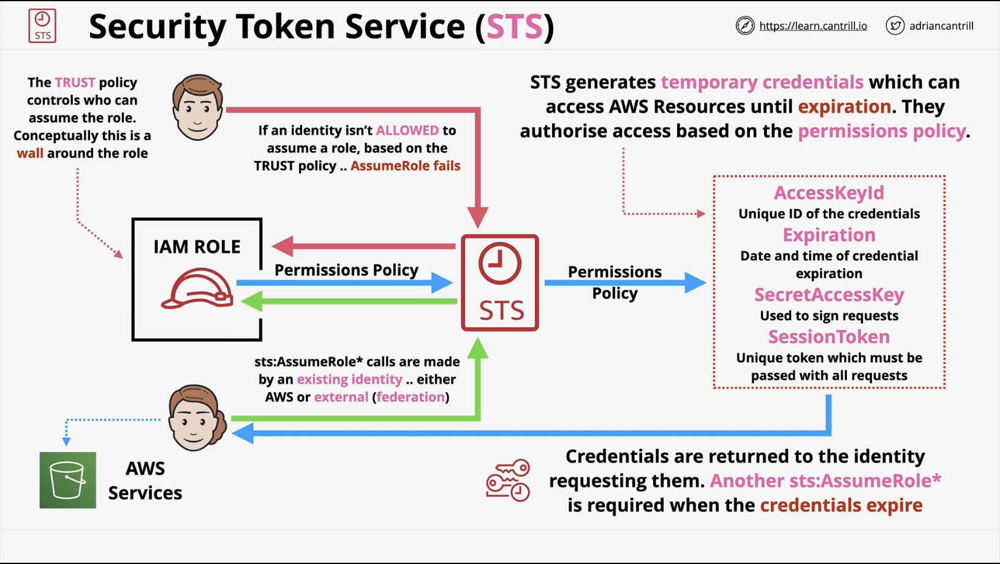

# Advanced Identity and Permissions

## Security Token Service (STS)

STS generates temporary credentials when the `sts::AssumeRole*` operation is used to gain access to temporary credentials. This happens behind the scenes.

This is similar to access keys, however these credentials are short-term and they expire after a certain duration.

The credentials generated are used to gain access to AWS resources. The credentials are requested by another identity or service via IAM or external.

    

## Boundary policies

They use JSON documents like identity policies but they don't grant any permissions only limit what permissions an identity can receive.

## AWS policy evaluation logic order

1. Explicit deny

    By default, all requests are denied unless a policy explicitly allows them. Check for any policy that has an explicit Deny that matches the request.

2. SCPs (Service Control Policies)

    SCPs are set on Organisational Units (OU).

3. Resource policies for services that support them eg. S3 buckets.

4. IAM permissions boundaries attached to the user or role.

5. Session policies, passed in the STS `AssumeRole` call and targets the session during which the role is assumed.

6. Identity-based policies attached to user or role.
