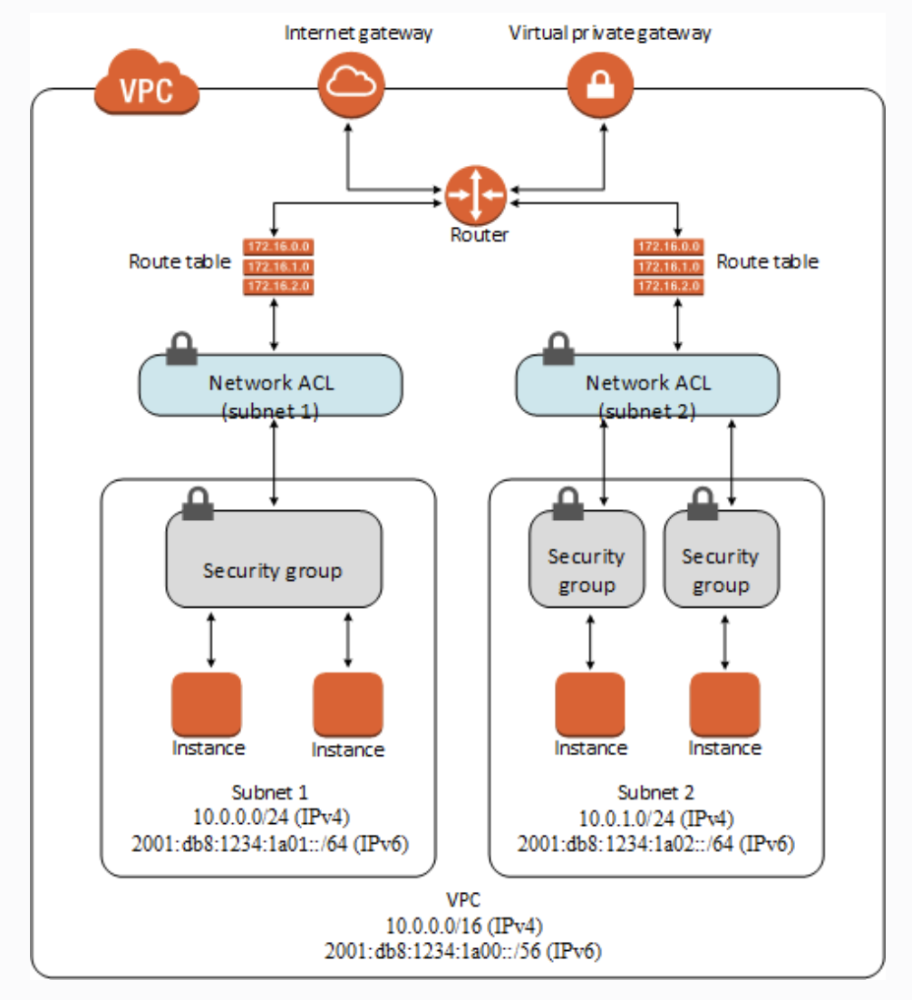

# Auto-Scaling Group

Auto-scaling allows EC2 to scale automatically based on demand placed on the system. Together with Elastic Load Balancers, Auto-scaling Groups (ASG) are used to deliver an elastic architecture.

An ASG which makes use of configuration defined in Launch Templates or Launch Configurations, has minimum and maximum desired capacity. It runs instances at a desired capacity by provisioning and terminating these instances.

## Scaling policy

Scaling policies help update the desired capacity based on metrics or criteria. They can be:

- **Manual**: where the desired capacity is manually adjusted

- **Scheduled**: for time-based adjustment

- **Dynamic**

    - Simple: based on metrics, for example when CPU usage exceeds 50%
    - Stepped: allows granular control for eg. if CPU usage is between 50 to 60% then add 1 instance, between 60 to 70% add 2 instances, etc. and the same in reverse.
    - Target tracking: it comes with a pre-defined set of metrics eg. CPU utilisation, average network in/out and ALB request count per target.

The `AWS::AutoScaling::AutoScalingGroup` resource uses the UpdatePolicy attribute to define how an Auto Scaling group resource is updated when the AWS CloudFormation stack is updated. This policy supports several configuration options amongst which are:

* `WaitOnResourceSignals` and `PauseTime`: when CloudFormation waits to receive a success signal until the maximum time specified by PauseTime value. If a signal is not received, CloudFormation cancels the update and rolls back the stack.
* `MinSuccessfulInstancesPercent`: prevents CloudFormation from rolling back the entire stack if only a single instance fails to launch

## Instance lifecycle

When EC2 Auto Scaling responds to a scale out event, it launches one or more instances. These instances start in the `Pending` state. If a lifecycle hook `autoscaling:EC2_INSTANCE_LAUNCHING` is added to the Auto Scaling group, the instance will move from the `Pending` state to the `Pending:Wait` state. After the lifecycle action is complete, the instance will enter the `Pending:Proceed` state. When fully configured and attached, the instance will enter the `InService` state.

Similary on a scale in event, the instance is detached form the Auto Scaling group and enters the `Terminating` state. Upon adding a `autoscaling:EC2_INSTANCE_TERMINATING` lifecycle hook, the instance will move from `Terminating` to `Terminating:Wait` state. After the hook is complete, the instance will enter the `Terminating:Proceed` state and eventually `Terminated`.

## Single EC2 instance fault tolerance

You can create an Amazon CloudWatch alarm that monitors an Amazon EC2 instance and automatically recovers the instance if it becomes impaired due to underlying hardware failure or other.

The built-in instance recovery failure feature for Amazon EC2 does not apply to instances using store volumes.

## ASG Lifecycle Hooks

Hooks enable configuring custom actions on instances to get executed for eg. during instance launch or termination.

This can be integrated with EventBridge, SNS notifications or SQS to allow event-driven processing based on launch or temination of EC2 instances within an ASG. A Lambda function on its own can not be used as a notification target for the lifecycle hook of an ASG.

## ASG Health Checks

EC2 instance health is evaluated in 3 ways:

- EC2: which is the default and uses the following unhealthy statuses: `Stopping`, `Stopped`, `Terminated`, `Shutting Down` or `Impaired`.

- ELB: is the load balancer health check where the instance needs to be both healthy and pass the load balancer health check.

- Custom: where an external system can be integrated to mark instances as healthy or not.

## EC2Rescue

Is a tool that can help diagnose and troubleshoot problems on EC2 Linux and Windows Server instances. You can run the tool manually or run it automatically by using Systems Manager Automation and the AWSSupport-ExecuteEC2Rescue document.

## VM Import/Export

Enables you to easily import virtual machine images from your existing envrionment to Amazon EC2 instances and export them back to your on-prem environment.

VM Import will convert the VM image to Amazon EC2 AMI which can be used to run EC2 instances. An image can be exported to an S3 bucket.

One use-case can be: launch an EC2 instance with the latest Linux OS in AWS. Use the AWS VM Import/Export service to import the EC2 image, export it to a VMware ISO in an Amazon S3 bucket and then import the ISO to an on-premises server.

It is worth noting that there is no way to directly download an ISO image from Amazon.

## Neworking

* **Security groups**: act as a firewall for associated Amazon EC2 instances controlling both inbound and outbound traffic at the instance level. When you launch an instance, you can associate it with one or more security groups that you've created. Each instance in your VPC could belong to a different set of security groups. If you don't specify a security group when you launch an instance, the instance is automatically associated with the default security group of the VPC.

* **Network access control lists (ACLs)**: act as a firewall for associated subnets, controlling both inbound and outbound traffic at the subnet level.

* **Flow logs**: capture information about the IP traffic going to and from network interfaces in your VPC. You can create a flow log for a VPC, subnet or individual network interface. Flow log data is published to CloudWatch Logs or Amazon S3 and can help in diagnosis.

    

