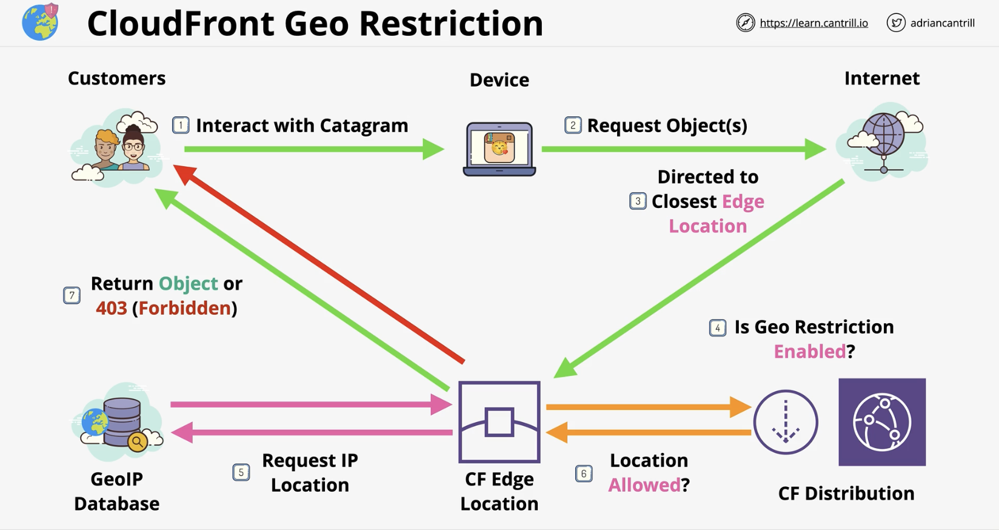

# Content Delivery Network

CloudFront is a content delivery network, used to improve the delivery of content to the viewers. It does so by caching and by using an efficient global network.

CloudFront is for download operations only, and uploads are done directly to the origin. CloudFront does read-only caching.

**Some terms:**

* Origin: the source location of the content. Can be S3 Origin or Custom Origin. Groups of origins can improve resiliency.

* Distribution: the unit of configuration within CloudFront.

* Behaviour: is contained within a distribution and works on the principal of pattern match.

* Edge location: pieces of the global infrastructure where data is cached locally. They are mostly used for storage/caching of data for CloudFront.

* Regional edge cache: they are bigger than edge locations and they are fewer. They are designed to cache data accessed less frequently but where there is a performance benefit.

## How it works?

1. Bob uploads some content to an S3 bucket which will be the origin of the CloudFront distribution.

2. Bob creates a CLoudFront distribution. The S3 bucket will be the origin in that distribution.

    The distribution will have a unique domain name which ends in `.cloudfront.net` and/or an alternate domain name.

    Bob can then deploy the distribution to the CloudFront network. The configuration will be pushed to edge locations which will cache the content distributed globally as close to the customers as possible.

    In between the edge locations and the origin are the regional edge caches. These are bigger than the edge locations.

3. When customers attempt to access Bob's data, they will be directed towards the closest edge location. The following scenatrios can take place:

    * Cache hit: the data is on the edge location and is served fast with low latency.
    * Cache miss: the edge location missing the data will check the closest regional edge cache.
        - if the data is there it will be served.
        - if the data is not there, origin fetch will take place where the data is fetched from the source. The regional edge location pushes the data to the edge location that requested it where the data be be cached there and returned to the user.

## CloudFront continuous deployment

The primary distribution is the 1 serving production traffic. You create a staging distribution which is a copy of the primary 1.

Viewers can not send requests directly to a staging distribution using a DNS name, IP address or CNAME. Instead, viewers send requests to the primary (production) distibution and CloudFront routes some of those requests to the staging distribution based on the traffic configuration settings in the continuous deployment policy.

CloudFront will route some viewer requests to the staging distribution based on 1 of 2 traffic configurations:

* Weight-based: this option routes the specified percentage of viewer requests to the staging distribution. Session stickiness is used with this option which helps CloudFront treat requests from the same viewer as part of a single session.

* Header-based: this option routes traffic to the staging distribution when the viewer request contains a specific HTTP header (you specify the header and the value). This is useful for local testing.

## CloudFront Behaviours

The Behaviour can be configured from the Distribution. There is a default behaviour (*) which matches all patterns.

Behaviour configurations include the origin source, protocol and methods, viewer access, Lambda function association, caching and TTL controls.

## CloudFront and origin failover

For high availability, CloudFront can be configured with origin failover by creating an origin group with 2 origins; a primary and a secondary. If the primary origin is unavailable, CloudFront switched to the secondary origin.

Failover happens per-request and not globally i.e. when a primary returns 200 for 1 request and 502 for another, only the failing request goes to the secondary. A practical pattern is to fail over to a static S3 bucket with a custom maintenance page.

## TTL and invalidation

When the data on the edge location becomes stale and needs to be refreshed.

The source could return a status 304 when the object is not expired and 200 status in case it needs to be refreshed along with the latest object.

An object is not expired when it is within its TTL (Time To Live). The default TTL is 24 hours.

Minimum TTL and Maximum TTL can be set using HTTP Headers sent from origin and they act as limiters.

**Cache invalidation**: invalidates an object independent of its TTL. It is performed on a distribution and uses pattern matching.

## CloudFront with other AWS services

CloudFront integrates with the AWS Certificate Manager (ACM) so SSL certificates can be used with CloudFront.

ACM can generate or import certificates. Generated certificates renew automatically but imported ones need to be renewed manually. Publicly-trusted certificates and not self-signed are allowed to be used with CloudFront distributions.

Not all services within AWS are supported by ACM, in general it is CloudFront and ALBs NOT EC2 which is a self-managed service. Because with EC2, you can always access the certificate which is not allowed by ACM.

ACM is a regional service. Certificates are locked to the region they are generated in. For global services like CloudFront, `us-east-1` is always used for ACM certificates.

There exists 2 SSL connections:

* Viewer protocol: Viewer <=> CloudFront
* Origin protocol: CloudFront <=> Origin

Both need valid public certificates.

If the origin is S3, S3 handles certificates natively and nothing needs to be done.

## CloudFront and SNI

In the past, every SSL-enabled website needed its own IP address. It is however possible to host 2 domains on the same server. The latter is achieved using a header in the request to indicate which website is requested.

In 2023, SNI (Server Name Indication) appeared which is a TLS extention that allows a client to tell the server which domain it is trying to access. This occurs within the TLS handshake before HTTP. This allows 1 server to host several websites. The issue is that older browser do not support SNI. Hence why CLoudFront supports both SNI but also IP per server at an extra cost.

## CloudFront and security headers

Amazon CloudFront supports adding HTTP security headers using response headers policies. This feature allows configuring CloudFront to include headers like `X-Content-Type-Options`, `X-Frame-Options` and `X-XSS-Protection` in HTTP responses. These headers can be attached by creating a custom policy or using an AWS-managed policy such as `SecurityHeadersPolicy`.

## Origin types

Origins are where CloudFront goes to get content. Origins are selected from the Behaviour section and they can be:

* S3 buckets
* AWS media package channel endpoints
* AWS media store container endpoints
* Everything else i.e. web servers

With S3 as origin, the same protocol is used on the viewer and origin sides.

## Cache invalidation

From the AWS console and in a distribution, under the invalidations tag, you can create a new invalidation. An invalidation is an operation which sends a directive to every edge location to invalidate 1 or more objects.

## Securing the CF content delivery path

How to make sure that a customer does not bypass CloudFront to access data in the origin directly.

### OAI (Origin Access Identity) - _Legacy, not recommended_

CloudFront Origin Access Identity (OAI) is an AWS feature that links CloudFront to a private S3 bucket. It is only applicable to S3 origins and not S3 static websites used as origin. Is a type of identity that can be associated with a CloudFront distribution where when the distribution is trying to access data, it becomes the OAI. The OAI can be used within bucket policy eg. DENY all except the OAI. This way a direct access to origin is denied.

This option is now legacy due to its limitations and AWS recommends migrating to OAC instead.

### OAC (Origin Access Control)

OAC helps secure the origin such as S3. It supports features like S3 buckets in multiple regions, S3 server-side encryption with AWS KMS and dynamic requests (PUT and DELETE) to S3.

OAC allows you to restrict access to your origin resources ensuring that they can only be accessed through the CloudFront distributions. This can be done by creating an OAC setting in the CloudFront distribution and updating the S3 bucket policy to grant access only to the CloudFront OAC, preventing direct access to the S3 bucket from any source including direct S3 URLs.

### Access identity for non-S3 origin

There are 2 ways around this:

1. Custom headers

    Configure CloudFront to send a custom header to the origin. Since this is over HTTPS, the headers are not visible and can not be immitated.

    If the header is missing, the origin will refuse the request.

2. Firewall

    Create a firewall around the custom origin to only allow requests from the edge location IP addresses and deny everything else.

## Delivering private content to end users

CloudFront can run in public or private modes. Private mode is achieved in 2 ways:

1. Signed URLs

    When a signer is added to a distribution, it becomes private. Trusted key groups are used to generate signed URLs.

    Signed URLS provide access to 1 object.

2. Signed cookies

    Cookies provide access to groups of objects and keeps the object URL intact.

    The signed cookie is generated via a Lambda function after authentication is done. This cookie is returned back to the user which will use it with the request sent to the CF distribution. Access to resources is then granted.

## Secure end-to-end connections

You can already configure CloudFront to help enforce secure end-to-end connections to origin servers by using HTTPS. Field-level encryption adds an additional layer of security along with HTTPS and lets you protect specific data such that only certain applications can see it.

Field-levels encryption allows you to securely upload user-submitted sensitive information to your web servers.

To use field-level encryption, you configure your CloudFront distribution to specify the set of fields in POST requests that you want to be encrypted, and the public key to use to encrypt them. You can encrypt up to 10 data fields in a request.

CloudFront field-level encryption uses asymmetric encryption, also known as public key encryption. You provide a public key to CloudFront, and all sensitive data that you specify is encrypted automatically. The key you provide to CloudFront cannot be used to decrypt the encrypted values; only your private key can do that.

## CloudFront Geo Restriction

Determines which areas of the planet can access content delivered via CF.

It has 2 types:

1. CF Geo Restriction

    Is a built-in, whitelist or blacklist architecture. This only works with countries. Uses a GeoIP database with 99.8%+ accuracy.

    

2. Third party Geolocation

    Is customisable. You can use this to access 3rd party geolocation services, so it can be more accurate. It can also be used to restrict based on users, browsers, or other and not just geolocation.

    It works using signed URLs or cookies.

## Lambda at the Edge

Lambda@Edge is a feature of Amazon CloudFront that lets you run code closer to users of your application which improves performance and reduces latency. It allows you to run lightweight Lambda functions at edge locations. They don't have the full Lambda feature set.

Use cases include:

* Triggering a Lambda function to execute a user authentication process in a specific AWS location proximate to the user
* A/B testing using a Viewer Request function
* As part of the Origin request eg. migration between S3 origins
* Customise behaviour based on the device type of a customer
* Vary the content displayed by country

## CloudFront Functions

Similar to Lambda@Edge, CloudFront Functions provide a way to run code in response to CloudFront events.

It is ideal for short-running functions such as:

* Transforming an attribute in a HTTP request header
* Request authorisation
