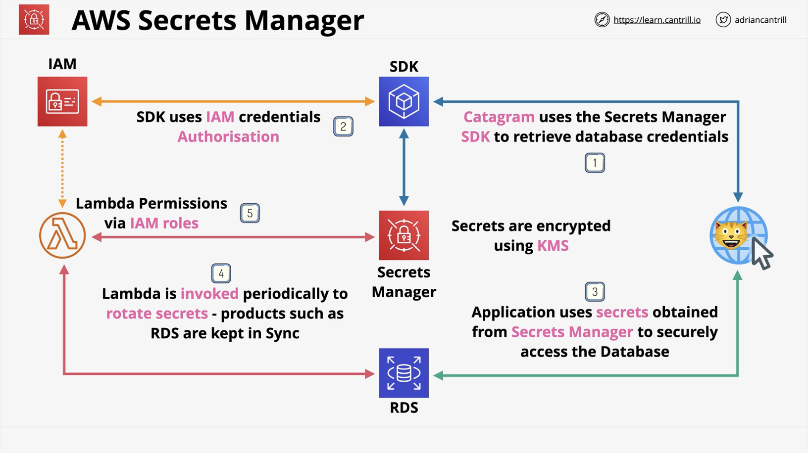

# Credentials and Secrets

## Parameter store

The Parameter Store is a sub product of the Systems Manager (SSM).

You can create a standard-tier (up to 10,000 parameters at 4 Kb size) or advanced-tier (more than 10,000 parameters at 8 Kb size plus other features) parameter.

You can create a parameter eg. `/app/app_username` of type String, StringList or Encrypted via the Key Management Service (KMS) that can be used to store configuration information.

## AWS Secrets Manager

It shares functionality with Paramter Store but is designed specifically for storing secrets (passowrds, API keys).

It can be used via the Console, CLI, API or SDK i.e. used from within applications. It supports the automatic rotation of secrets (via Lambda) and directly integrates with some AWS products for eg. when a secret is rotated, it is changed also inside an RDS (Relational Database Service).

Secrets Manager integrates with IAM and its secrets are encrypted using KMS. It can store secrets up to 12 Kb in size each.

    

