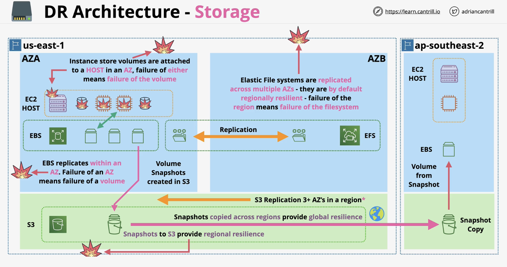

# Disaster Recovery

## Storage DR

DR is based on different types of storage that in turn have different levels of resiliency.

**1. Instance store volumes**

Those are physical storage attached to EC2 hosts that can run EC2 instances.

This is viewed as temporary and unreliable storage.

**2. EBS: Elastic Block Store**

Allows creating volumes that can presented to EC2 instances. Those are not replicated across AZs.

**3. S3: Simple Storage Service**

This is replicated across multiple AZs in a region. So you can create a snapshot of an EBS volumes and store that in an S3 bucket.

**4. EFS: Elastic File System**

This is replicated across multiple AZs in a single region. It can tolerate the failure of an AZ.

    

## Compute DR

There are no truely global compute services available from AWS. So the focus for compute will be in 1 particular region.

**1. EC2**

EC2 instances are not too reliable since they are meant to exist in 1 AZ and there is always a chance that the EC2 host they run on fails. If it is a host failure, the EC2 instance can be recreated in the same region on a new host.

An ASG (Auto Scaling Group) can be set to run between 2 AZs. This increases reliability.

**2. ECS**

ECS (Elastic Container Service) clusters can be in EC2 mode or Fargate mode. In EC2 mode, they have DR characteristics same as EC2 i.e. AZ failure means ECS container host failure.

ECS in Fargate mode achieve similar characteristics as ASG i.e. the architecture can span across 2 AZs.

**3. Lambda**

Lambda is not a VPC-based service and can run in private or public mode (default). It would take the failure of an entire region to affect the service of a Lambda function.
