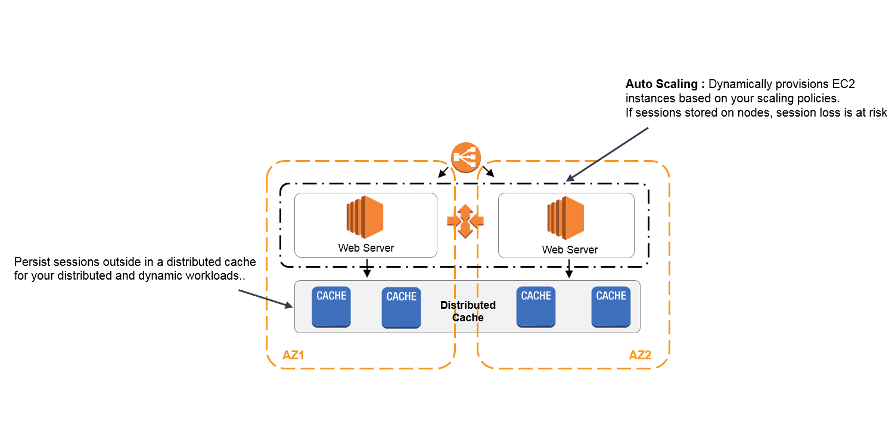

# ElastiCache

Is a serverless fully managed caching service delivering microsecond latency performance with full Valkey, Memcached and Redis OSS (Open Software Service) compatibility.

It can be used as a distributed session cache such that users remain logged into their sessions when an application redeploys.

    

