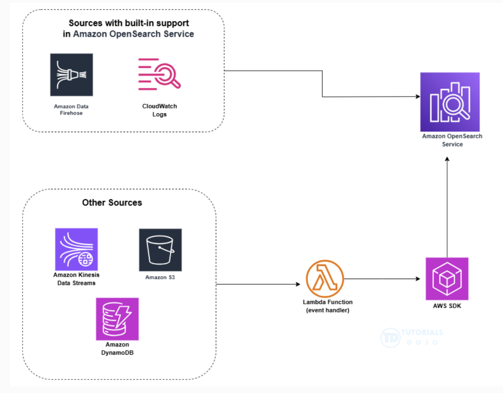

# Final exam notes

## CI/CD

### CodeBuild

* For the CodeBuild service to properly download encrypted files from an S3 bucket, the CodeBuild service should have the right role permissions for the KMS key used for encryption.

* CodeBuild supports local caching of dependency directories (eg. `.npm`, `pip`) to speed up builds by avoiding redownloading packages.

* Parameter masking in CodeBuild redacts environment variables marked as secrets, preventing them from being displayed in logs or console output.

### CodeDeploy

* To verify the health of a Fargate application, look for CodeDeploy successfully deploying as well as no errors in the CloudWatch alarms.

* A pre-traffic hook in a blue/green CodeDeploy deployment allows you to run logic (eg. tests or config checks) before shifting any traffic to the new environment.

* A CodeDeploy strategy that is efficient for updating thousands of EC2 instances with minimal service disruption is the rolling update strategy.

    Rolling deployments divide EC2 instances into batches, updating them incrementally to ensure that the application remains available during the rollout.

* Registering on-prem servers with CodeDeploy:
    - Create an IAM role that the on-prem instances will assume
    - Generate temporary credentials for individual instances using AWS STS
    - Set up a Cron job to refresh those credentials regularly
    - Install CodeDeploy agent on the on-prem servers
    - Register the on-prem servers with CodeDeploy
    - Create tags for the on-prem servers
    - Set up a deployment group based on the tags

* CodeDeploy is not a destination for SNS messages. However a deployment group can be configured to monitor an alarm. If the alarm enters the ALARM state, the deployment will automatically fail and roll back.

* CodeDeploy offers 3 deployment types for Lambda functions:

    - Canary
    - Linear
    - All-at-once

* The application specification file (AppSpec file) is a YAML or JSON file used by CodeDeploy to manage a deployment.

    The `BeforeAllowTraffic` and `AfterAllowTraffic` lifecycle hooks of the `AppSpec.yaml` file allow you to use Lambda functions to validate service activity during deployment.

* CodeDeploy deployments can be monitored using the following CloudWatch tools:

    - Amazon EventBridge (formerly CloudWatch Events)
    - CloudWatch alarms
    - CloudWatch Logs

    As part of CodeDeploy operations, EventBridge can be set up with the following targets:

    - Lambda functions (eg. pass notifications to Slack when deployment fails)
    - Kinesis streams (eg. for realtime status monitoring)
    - SQS queues
    - SNS topics
    - built-in targets like CloudWatch alarm actions (eg. CloudWatch alarm actions used to automatically stop, terminate, reboot or recover EC2 instances upon a specific event)

### CodePipeline

* For a CI/CD pipeline to deploy resources in multiple AWS accounts, create a cross-account IAM role in the target account that trusts the pipeline account. Also update the pipeline to assume the cross-account role in the target account.

* Manual approval actions pause a CodePipeline pipeline such that a human can approve a release to prod.

* AWS CloudTrail records API-level actions including pipeline stage executions, approvals and deployment events enabling full auditability of the CI/CD flow.

* Canary deployment helps minimise risk by routing a small portion of the traffic to the new version before scaling up.

* CodePipeline offers a feature to retry individual failed stages allowing developers to fix and resume deployments without re-running the full pipeline workflow.

* CodePipeline integrates with external systems using SNS or Lambda allowing teams to implement Slack, Jira or custom approval workflows between pipeline stages.

* CodePipeline can only have one source stage. To trigger CodePipeline when code is pushed in more than 1 repo, an EventBridge rule can be created for each repo that can trigger the same CodePipeline.

* AWS CodePipeline includes a number of actions that help you configure build, test, and deploy resources for your automated release process. If your release process includes activities that are not included in the default actions, such as an internally developed build process or a test suite, you can create a custom action for that purpose and include it in your pipeline.

    You can create custom actions for the following AWS CodePipeline action categories:

    - A custom build action that builds or transforms the items

    - A custom deploy action that deploys items to one or more servers, websites, or repositories

    - A custom test action that configures and runs automated tests

    - A custom invoke action that runs functions

    When you create a custom action, you must also create a job worker that will poll CodePipeline for job requests for this custom action, execute the job, and return the status result to CodePipeline. This job worker can be located on any computer or resource as long as it has access to the public endpoint for CodePipeline. To easily manage access and security, you can host your job worker on an Amazon EC2 instance.

* If you define a CodePipeline structure using a JSON file, the default `runOrder` value for an action is 1 for sequential execution. To specify parallel actions, use the same integer/value for every action you want to run in parallel.

### IaC

* To prevent accidental _replacement_ of an RDS instance during a CloudFormation stack update, use CloudFormation Stack Policy to prevent updating the database.

* Terraform is cloud-agnostic and supports multiple providers incl. AWS, Azure and on-prem. It's the most flexible IaC tool in hybrid cloud or multi-cloud scenarios.

* Terraform workspaces can isolate environments and `assume_role` allows secure cross-account access using STS.

* Remote state locking in Terraform prevents simultaneous apply operations from different sources avoiding race condition and corrupted infrastructure state.

* To scan IaC templates for security misconfigurations before deployment, use static analysis tools like tfsec (Terraform) and cfn-nag (CloudFormation) to scan for vulnerabilities, missing encryption, open ports or IAM risks.

* During IaC migration, the Terraform `import` command lets you bring manually created or existing AWS resources under Terraform management without recreating or destroying them.

* To specify how CloudFormation handles updating an ASG, you can add an `UpdatePolicy` attribute in the YAML or JSON. This attribute contains the `AutoScalingReplacingUpdate` policy which enables you to specify whether AWS CloudFormation replaces the ASG with a new one or replaces only the instances in the ASG.

    ```YAML
    UpdatePolicy:
        AutoScalingReplacingUpdate:
            WillReplace: true
    ```

    This configuration in the CFN YAML will allow it to retain the old group until it finishes creating the new one. If the update fails CFN can roll back to the old ASG and delete the new one.

## Lambda

* Lambda functions are region-based and automatically use multiple AZs.

* For non-zero downtime when deploying Lambda updates, use a weighted alias that allows controlling traffic, shifting to new Lambda versions and reducing deployment risks.

* To implement canary deployment for a Lambda function, CodeDeploy natively supports Lambda canary deployments with built-in traffic shifting and automatic rollback based on CloudWatch alarms. The `Canary10Percent5Minutes` perference shifts 10% of traffic initially then completes the deployment after 5 minutes if no alarms trigger.

## Roles and organisations

* To deploy standardised IAM roles to all current and future accounts within an organisation, deploy a CloudFormation StackSet targeting the organisaton root.

    A StackSet is like a stack but it deploys accross multiple regions and accounts.

* A Permission Set is a template that you create and maintain that defines a collection of 1 or more IAM policies. You can assign a Permission Set to users or groups.

    SCPs (Service Control Policies) restrict access to AWS services and actions across AWS accounts. SCPs apply to users, roles and groups in member accounts not to management accounts.

    A Permission Set policy will override an SCP for a group (or other) in a management account.

## S3

* S3 Event Notifications: is a feature to receive notifications when certain events happen in the S3 bucket.

* S3 Lifecycle policy configuration or rules allow you to define actions that you want S3 to take during an object's lifetime eg. deleting objects after a period of time.

## Automation

* To manage security patches for EC2 instances and on-prem servers, install the AWS Systems Manager agent and create a Hybrid Activation.

* State Manager allows adminstrators to apply and maintain consistent configurations using pre-defined or custom SSM documents ensuring automated and continuous compliance across accounts.

* Amazon ECR supports image scanning via Amazon Inspector or other integrated tools to detect known vulnerabilities in containers before deployment.

* A conformance pack is a collection of AWS Config rules and remediation actions that can be deployed as a single entity in an account, region or across an organisation. They can ensure that all deployed infrastructure meets compliance and security standards automatically.

* EC2 Auto Recovery monitors health and recovers the instance in the same AZ. It ensures quick recovery without manual intervention.

* An ECS service maintains the desired task count and automatically replaces failed tasks when integrated with health checks.

* Elastic Disaster Recovery (DRS) can be set up on source servers to initiate secure data replication. This minimises downtime and data loss reducing both RTO and RPO significantly.

* Route53 health checks with latency routing provide automated failover and route users to the nearest healthy region.

* Note that AWS Config evaluates periodically and not in real-time. It continuously evaluates resources against rules. It triggers automatic remediation using an SSM Automation document.

* AWS Config can not be used to perform emergency maintenance on instances.

* To ensure that an application does not experience downtime during database credentials rotation, a multi-user rotation strategy is used where the Secrets Manager creates 2 database users and alternates between them during rotation.

* A Lifecycle hook can be used to provide feedback to the auto-scaling group about the success or failure of a custom script. The ASG uses this information to either start sending traffic to the new EC2 instance or to terminate it.

* Elastic Beanstalk configuration files `.ebextensions` have higher precendence than default values. Values that are specified as arguments to the EB CLI cannot be overriden by `.ebextensions` file.

    Instance type (aka flavor) can be overwritten by the `.ebextensions` file.

* In API Gateway, you can create a canary release deployment when deploying the API with canary settings.

    There is no canary routing option in an ALB.

    NLB does not support weighted target groups, unlike ALB.

* Elastic Beanstalk provides those deployment policies:

    - All-at-once (default)
    - Rolling (default for EB CLI)
    - Rolling with additional batch
    - Blue/green
    - Immutable

    Immutable launches a new set of instances running the new version of the application in a separate ASG alongside the instances running the old version.

    Immutable deployments can prevent issues caused by partially completed rolling deployments. The original instances remain untouched in case of any failure.

* Amazon Rekognition can store information about detected faces in server-side containers known as collections. You can use the facial information that's stored in a collection to search for known faces in images, stored videos and streaming videos. Amazon Rekognition supports the IndexFaces operation. This can be used to detect faces in an image and persist information about facial features that are detected in a collection.

## Security

* For a web app to maintain performance during a DDoS attack, CloudFront with WAF can be used to filter malicious traffic.

* Unlike an Internet Gateway (IGW) which allows both inbound and outbound IPv4 traffic, an egress-only Internet Gateway allows only outbound IPv6 traffic.

    A VPC can have only 1 IGW attached at any given time.

## Monitoring and Logging

* Memory metrics are not available by default in CloudWatch for EC2 instances. A CloudWatch agent must be installed and configured on the instance to obtain internal metrics like memory utilisation, disk usage, process health, etc.

* X-Ray helps trace and visualise requests across microservices providing insight into performance bottlenecks and dependencies.

* CloudWatch Logs Insights allows teams to query logs and detect anomalies using pattern recognition and statistical analysis.

* CloudWatch log subscriptions can be used to route logs from multiple accounts to a centralised logging account for auditing and analysis.

* CloudWatch Container Insights provides granular metrics like memory and CPU for ECS tasks, making it suitable for memory-related monitoring.

* CloudWatch Anomaly Detection uses ML models to baseline normal metrics behaviour and detect outliers without static thresholds.

* To collect application logs and metrics from all containers, install Fuent Bit which can aggregate and forward logs and metrics from containers to CloudWatch enabling centralised logging.

* VPC Flow Logs is a feature that can be enabled on a VPC, subnet or Elastic Network Interface (ENI) so that network traffic can be logged to CloudWatch Logs.

* To improve observability, use X-Ray and OpenTelemetry (OTel) which provide deep observability for distributed services and improve trace analysis.

* In case of a custom application metric that is not supported natively in CloudWatch but needs to be monitored, the metric can be published from the application using the CloudWatch `PutMetricData` API.

* CodeGuru Profiler collects runtime performance data from live applications and provides recommendations to help improve the code to improve performance. It focusses on code optimisation.

* CodeGuru Reviewer uses program analysis and ML to detect potential defects and issues in the code. It also provides guidelines for best practices in Java and Python code.

    CodeGuru Reviewer should be associated with a Git repo and is not integrated with CodeBuild.

* EventBridge can monitor AWS service events such as EC2 instance state changes. A rule in EventBridge can be set up that matches specific EC2 state changes, matching events can then be routed to a Lambda function.

* SNS integrates directly with CloudWatch alarms. Alarms can trigger SNS to notify teams instantly.

* Amazon Data Firehose is a fully managed service that delivers real-time streaming data to various destinations. It allows you to capture, transform and load streaming data into data stores and analytics tools.

    A Firehose stream is the underlying entity of Amazon Data Firehose. You use Amazon Data Firehose by creating a Firehose stream and then sending data to it. In the Firehose stream, you can configure the source of the streaming data, optionally add data transformation steps and destination for the data.

    Lambda functions can transform and process data as it flows through a Firehose stream.

* Although CloudWatch Logs allow you to filter and transform log data before delivering it to a destination, they are not designed for complex transformations of data like geolocation and IP enrichment.

    CloudWatch Logs centralises logs from various sources and includes metric filters that allow you to extract specific data from log events and record it as a CloudWatch metric. The metrics can be used for monitoring and alerting.

    CloudWatch Anomaly Detection uses ML to identify unusual patterns in your metrics.

* You can load streaming data into your Amazon OpenSearch service for many different sources.

    Amazon Data Firehose and CloudWatch Logs have built-in support for OpenSearch service (formely aka ElasticSearch).

    S3, Kinesis Data Streams and DynamoDB use Lambda functions as event handlers.

    Kinesis streams are currently the only source supported as a destination for cross-account subscriptions.

    <div align="center">
        
    </div>

* AWS Health provides ongoing visibility into the state of your AWS resources, services and accounts. The service delivers alerts and notifications triggered by changes in the health of AWS resources so that you get near-instant event visibility and guidance to help accelerate troubleshooting.

    The Personal Health Dashboard (PHD) can be used which is powered by the AWS Health API.

    CloudWatch Events can be used to detect and react to changes in the status of AWS PHD events. Then, based on the rules defined, CloudWatch Events invokes 1 or more target actions when an event matches the value specified in the rule.

* AWS Trusted Advisor inspects your AWS environment and then makes recommendations when possible to save money, improve system availability and performance or help close security gaps.

    Trusted Advisor is integrated with the Amazon EventBridge and CloudWatch services.

* The ability to search and filter the log data arriving at CloudWatch Logs is achieved by creating one or more metric filters.

    Metric filters define the terms and patterns to look for in log data as it is sent to CloudWatch Logs.

## Disaster recovery

* Application Recovery Controller (ARC) is a service that simplifies and automates the recovery of applications deployed across multiple AZs and regions. It enhances application resilience by managing failover and recovery during outages.

    ARC integrates with services like Route53 and Elastic Load Balancing.

    Zonal shift is a feature in Route53 ARC that can temporarily shift traffic from an impaired AZ to a healthy one.

    Disabling cross-zone load balancing on an ALB means that each load balancer node in an AZ routes requests only to targets within the same AZ.

## Configuration management

* Patch Manager uses patch baselines, which include rules for auto-approving patches within days of their release.

    Patches can be installed by scheduling them to run as a Systems Manager maintenance window task. Patches can be installed individually or to large groups of instances by using EC2 tags.

* With AWS Config, you can:

    - Evaluate AWS resource configurations for desired settings
    - Get a snapshot of current configurations
    - Retrieve historical configurations of 1 or more resources
    - Receive a notification whenever a resource is created, modified or deleted
    - View relationships between resources

* An aggregator is an AWS Config resource type that collects AWS Config configuration and compliance data from:

    - multiple accounts and multiple regions
    - single account and multiple regions
    - an organisation in AWS Organizations and all the accounts in that organisation

* When you add a rule to AWS Config, you can specify when you want it to evaluate the rule i.e. the trigger. There are 2 types of triggers:

    1. Configuration changes
    2. Periodic

    If both triggers are chosen, AWS Config invokes the Lambda function when it detects a configuration change and also at the frequency specified.

* AWS Application Discovery Service helps you plan your migration to the AWS cloud by collecting usage and configuration data about your on-prem servers. Application Discovery Service is integrated with AWS Migration Hub.

    Application Discovery Service offers 2 ways of performing discovery and collecting data about your on-prem servers:

    - Agentless discovery: performed by deploying the AWS Agentless Discovery Connector (OVA file) through your VMware vCenter.

        The Agentless discovery uses the AWS Discovery Connector which is a VMware appliance that can collect information only about VMware virtual machines (VMs). This mode does not require you to install a connector on each host. You install the Discovery Connector as a VM in your VMware vCenter Server environment using an Open Virtualisation Archive (OVA) file.

    - Agent-based discovery: done by deploying the AWS Application Discovery Agent on each VM and physical server.
