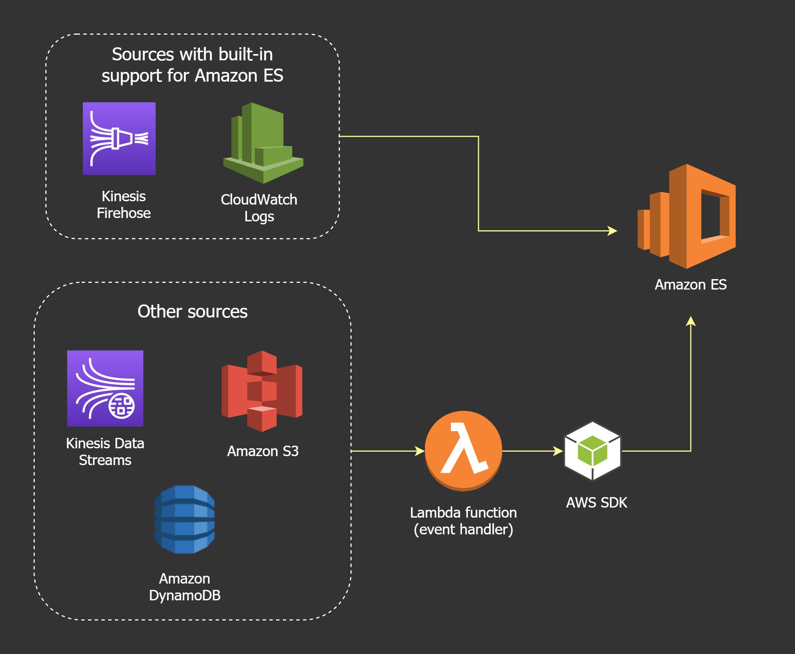

# Kinesis

Is a scalable realtime streaming service designed to ingest data from lots of devices or applications.

Producers send data to Kinesis eg. EC2, IoT, applications, etc.

The Kinesis stream ingests the data and the Consumers consume this data.

The stream starts with 1 shard and increases the number of shards as it scales. A shard provides 1 MB/sec ingestion and 2 MB/sec consumption capacity.

## Amazon Kinesis Data Firehose

Is a fully-managed service that delivers data to supported services like S3 allowing data to be persisted beyond the rolling window of Kinesis data streams.

It is a near-realtime service where data of size 1MB is buffered for 60 secs before delivery.

Data Firehose can deliver data to HTTP endpoints, Splunk, Redshift, ElasticSearch and S3.

Firehose can transform data using Lambda before delivering it.

## Amazon Kinesis Data Analytics

Is a service that provides realtime processing of data which flows through it using SQL.

It ingests from Kinesis Data Streams or Firehose.

The destination for the data can be Streams, Firehose or any of the services that Firehose supports.

## Amazon EMR (Elastic Map Reduce)

This service is a managed implementation of Apache Hadoop which is a framework for handling big data workloads using the map reduce framework.

EMR runs in 1 AZ in a VPC and uses EC2 for compute. It can load input data from S3 into HDFS (Hadoop filesystem) and store output data in back to S3.

The EMR cluster architecture consists of:

* The HDFS which runs alongside the cluster and is ephemeral i.e. linked to the lifetime of the cluster
* a master node which manages the cluster and can be ssh-ed to
* a number of core nodes that act as data nodes for HDFS and can run or track tasks
* task nodes that are optional and have no HDFS involvement, they just run tasks
* EMRFS is a filesystem that is backed by S3 and can persist beyond the lifetime of the EMR cluster

## Amazon Redshift

Is a petabyte-scale data warehouse where many different operational databases from across your business can pump data into for long-term analysis. It is designed for reporting and analytics not for operational-style usage.

It is an OLAP (column-based) database and not OLTP (row/transaction).

It lives in 1 AZ in a VPC. It includes a leader node and a compute node.

It includes some useful features like:

* Redshift Spectrum which allows querying the data on S3 without loading it to Redshift
* Federated query which allows querying data in remote data sources

## Amazon QuickSight

Is a business analytics and intelligence service (BA/BI) used for visualisations and ad-hoc analysis of data.

## Amazon Athena

Is a serverless interactive querying service to perform ad-hoc queries on data in S3 where loading/transformation of data is not requried.

It uses a process called schema-on-read which modifies data in-flight as it's read and translates it to a table-like schema.

## Streaming data to OpenSearch (formerly ElasticSearch)

You can stream data into OpenSearch from any service in AWS. Some services like Amazon Data Firehose and CloudWatch Logs have built-in support. Other services like Amazon S3, Kinesis Data Streams and Amazon DynamoDB use AWS Lambda functions as event handlers. [Image source: Tutorialsdojo.com]

    

