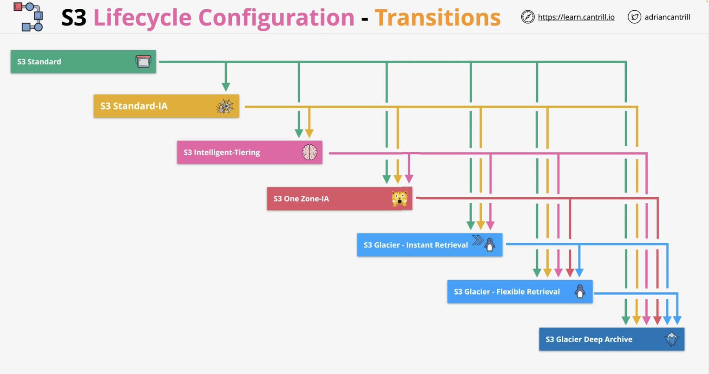

# S3 misc.

## S3 security

S3 is private by default.

An S3 bucket policy is a form of resource policy; it is like identity policies but attached to a bucket.

Bucket policies can be complex for eg. deny access to an IP address range / if the identity using the bucket does not use MFA.

**Access Control Lists (ACLs)**

Are legacy and not recommended to use by AWS but they are used to apply security to objects or buckets.

## S3 static website hosting

It allows access via standard HTTP by individuals using a web browser.

When you enable this, you have to set an index and an error document.

## S3 bucket object versioning

By default, this is disabled. Once enabled, it can not be disabled again. The bucket however can be suspended and the versions deleted then re-enabled.

Versioning lets you store multiple versions of an object in a bucket.

An object has a key (name) and an ID (used for versioning). When versioning is disabled, the ID is null. But when versioning is enabled and an object is accessed without specifying an ID, the latest object is assumed.

When an object is deleted without specifying a version, a Delete Marker is added which is a special version of an object which hides all previous versions of that object. The Delete Marker can be deleted and the object can be active again.

To fully delete an object, you need to specify a version.

## S3 bucket upload

By default, data is uploaded to S3 in a single blob of data in a **single stream**. A file is uploaded using the `s3:PutObject` action and put into a bucket.

But if a stream fails, the upload fails and nothing is uploaded. And a PUT upload is limited to 5GB of data in a single stream.

**Multipart upload** however improves the speed and reliability of uploads to S3. It does this by breaking data down into various blobs. The minimum size of the data uploaded should be 100MB.

An upload can be split into a max of 10,000 parts and each part can range in size from 5MB to 5GB. Unlike single stream upload, each part can fail in isolation and restart in isolation. Transfer rate; which is the speed of all parts, is therefore improved.

## S3 Accelerated Transfer

Data can take inefficient routes to reach its destination especially if travelling from country to another. This can slow down data transfer due to this low performance.

Transfer acceleration for S3 uses the network of AWS edge locations located globally in convenient locations. This is by default switched off and needs to be enabled given certain restrictions.

The AWS network is purposely build to connect regions with one another.

## S3 server-side encryption

Buckets are not encrypted, objects are. Objects can use different encryption settings.

Knowing that data to and from S3 is encrypted in transit, encryption at rest i.e. how data is stored on disk can be:

**client-side encryption:**

Data is encrypted at the client side and S3 receives data that is already encrypted. The client is responsible for the encryption keys and for the encryption process. Here, S3 is just used for storage.

**server-side encryption:**

Data is not encrypted on the client side but when it reaches S3 it gets encrypted. FYI encryption at rest is mandatory on S3.

Serve-side encryption for S3 objects has 3 types:

1. SSE-C (server-side encryption with customer-provided keys)

The customer is responsible for the keys but S3 handles the cryptographic operation.

2. SSE-S3 (server-side encryption with Amazon S3-managed keys)

This is the default. S3 provides the key and the encryption process.

3. SSE-KMS (server-side encryption with KMS keys stored in AWS KMS)

Here, the KMS service is involved. The client has control over the KMS key. S3 handles the encryption process.

## S3 bucket keys

This helps S3 scale and reduce cost when using KMS encryption.

Usually every object requires a unique KMS key to get encrypted. Which means that for every S3 object, a unique KMS key is needed. This increases cost due to the many requests to KMS, it might also be subject to throttling restrictions.

With bucket keys, instead of the KMS key being used to generate many data encryption keys, it is used to generate a time-limited bucket key. The bucket key is then used to generate data encryption keys for objects in the bucket. This reduces KMS API calls, reduces cost and improves scalability.

## Object storage classes

**1. S3 Standard**

This is the default class where objects are replicated across at least 3 AZs. It can cope with AZ failure. It provides 11 nines (9s) of durability. The replication uses Content-MD5 Checksums and Cyclic Redundancy Checks (CRCs) to detect and fix any data corruption.

Billing is 1 GB per month fee for data stored. A $ per GB charge for transfer OUT (IN is free) and a price per 1,000 requests. No retrieval fee.

This class should be used for frequently accessed data which is important and non-replaceable.

**2. S3 Standard-IA (infrequent access)**

Shares most of the architecture of S3 Standard however it is much cheaper than S3 Standard.

It has a retrieval fee per GB of data, it is therefore designed for minimally accessed data.

It has a minimum duration charge of 30 days.

This class should be used for long-lived data which is important but where access is infrequent.

**3. S3 One Zone-IA**

This is cheaper than Standard and Standard-IA but with some compromise.

Shares most of the features of Standard-IA but data is not replicated and is stored in 1 AZ only.

This class should be used for long-lived data which is not critical and replaceable and where access is infrequent.

**4. S3 Glacier Instant Retrieval**

Is like S3 Standard-IA but has cheaper storage, more expensive retrieval and longer minimum storage duration of 90 days instead of 30.

Although it costs more to access the data, instant data access is still an option here.

**5. S3 Glacier Flexible Retrieval**

This allows storing data in a chilled state.

Similar to S3 Standard but with a storage cost 1 sixth of the cost of S3 Standard. It is therefore cost-effective but with some tradeoff.

Objects stored here are cold and not immediately available. Objects cannot be made publicly available and to gain access, a retrieval operation needs to be performed.
You pay for object retrieval and they are stored in the S3 Standard class on a temporary basis. They are removed once accessed.

Retrieval can be **expedited** (1-5 minutes), **standard** (3-5 hours) and **bulk** (5-12 hours). The faster, the more expensive. Objects have a first byte latency in minutes or hours so this is not ideal for static website hosting.

Some limitations here are a 40KB minimum billable size and a 90 day minimum billable duration.

This class is ideal for archival data where frequent or real-time access is not needed.

**6. S3 Glacier Deep Archive**

Is the cheapest storage class and allows storing data in frozen state. It also has 40KB minimum billable size and 180 day minimum billable duration.

Similar to Glacier Flexible, objects are not publicly available and a retrieval job is needed to access the data.

Data is temporarily retrieved to S3 Standard-IA which takes 12 hours and Bulk up to 48 hours.

First byte latency is in hours or days.

**7. S3 Intelligent-Tiering**

Is a storage class that contains 5 different storage tiers:

* Frequent access
* Infrequent access
* Archive instant access
* Archive access
* Deep archive

The system monitors the usage of an object and moves it for you into the right tier based on frequency of access.

This class is good for data where the access pattern changes or is not known.

## S3 lifecycle configuration

You can create lifecycle rules on S3 buckets which can automatically transition or expire objects in the bucket.

Lifecycle configuration is a set of rules that consist of actions which apply based on criteria i.e. do X if Y. They can be applied on a bucket or a group of objects in that bucket defined by prefix or tags.

Actions can be of 2 types:

* Transition actions: they can change the storage class of an object eg. from S3 Standard to S3 Standard-IA.

Note this exception: objects in S3 One Zone-IA can transition into S3 Glacier Flexible Retrieval or S3 Glacier Deep Archive but not S3 Glacier Instant Retrieval.

    

Transition can not happen in an upward direction, only downward.

Note that if an object is stored in S3 Standard, it requires to have been there for a minimum of 30 days before transitioning to an infrequent access tier like S3 Standard-IA or S3 One Zone-IA.

A duration of 30 days is required if objects were to transition further from IA tiers to Glacier classes.

* Expiration actions: they can delete objects or object versions.

## S3 Replication

Replicating objects between a source and destination S3 bucket. 2 types of replication are supported by S3:

1. Cross-Region Replication (CRR)

Allows replication of objects from a source bucket to 1 or more destination buckets in different AWS regions.

2. Same-Region Replication (SRR)

The same process but where the source and destination buckets are in the same region.

An IAM role is configured to allow the S3 service to use it. The premissions on this role allows it to read data on the source bucket and replicate them on the destination bucket.

In case of replication between different AWS accounts, a bucket policy on the destination bucket is needed to allow the IAM roles to replicate data into it.
Replication between bucket of the same account do not need this policy because the destination bucket trusts the source bucket.

You can replicate all objects or a subset and you can choose the storage class to be used. You can also define ownership of the objects eg. owned by the account of the destination bucket. You can also define a Replication Time Control (RTC) between the source and destination bucket.

### Notes in replication

By default, replication is not retroactive i.e. objects that were already there are not replicated. Batch replication can be used to replicate existing objects.

Versioning needs to be ON.

Replication is one-way and is not bi-directional.

Replication is able to handle objects that are unencrypted, SSE-S3, SSE-KMS and SSE-C.

Replication can not happen on objects in Glacier or Glacier Deep Archive.
