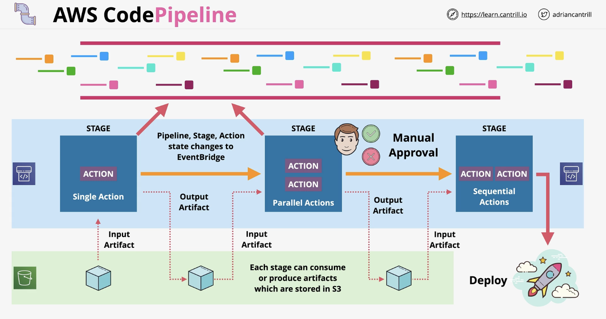

# SDLC Automation

A development pipeline can be generally broken down to the following stages:

1. code
2. build
3. test
4. deploy

AWS provides a range of tools that support all of those stages, for eg.

* CodeCommit similar to GitHub
* CodeBuild which can handle the build and test processes
* CodeDeploy which supports code deployment within AWS

These AWS tools are isolated but they can be configured together using AWS CodePipeline which orchestrates the development pipeline.

A pipeline is linked to 1 branch in a repository eg. a `main` pipeline and a `dev` pipeline.

## CodeDeploy

Is a code deployment as-a-service product. It deploys code not resources i.e. a web application and not a fleet of EC2 instances.

A CodeDeploy agent needs to be installed which communicates with the product and implements instructions.

Can deploy code to:

* EC2 instances
* Elastic Beanstalk
* AWS OpsWorks
* Amazon ECS

It can be used to deploy using CloudFormation.

### The appspec file

CodeDeploy is customised using `appspec.yml` or `appspec.json` files.

This file contains configuration + lifecycle event hooks.

Lifecycle event hooks such as ApplicationStop, DownloadBundle, BeforeInstall, Install, AfterInstall, ApplicationStart, ValidateService.

The configuration section has:

* files (for EC2/on-premise): provides information to CodeDeploy about which files need to be installed on the EC2 instance during the deployment.
* resources (for ECS/Lambda): for Lambda it contains the information about the Lambda function used during deployment. For ECS, it contains things like task definitions or container information.
* permissions (for EC2/on-premise): details any special permissions that need to be applied on parts of the filesystem.

## CodePipeline

Is a continuous delivery tool designed to control the flow from source code through build and finally deployment. It is the glue that holds things together.

Pipelines are built from Stages which contain sequential or parallel actions. The output of one action can be the input of another action.

    

## CodeBuild

Is a build-as-a-service product that lets you manage a build environment where you pay for the resources consumed during builds. It is also used during the test stage.

It gets the source code from GitHub, CodeCommit, CodePipeline, S3, etc.

Can log output to S3 and CloudWatch Logs. Can also push events to EventBridge.

### The build file

CodeBuild can be customised via the `buildspec.yml` in the root directory.

This file has 4 main phases:

1. install: for major environment installations
2. pre_build: install dependencies
3. build: source code is built into application
4. post_build: to package things up, push to Docker or send notifications

The build spec file also allows you to define environment variables eg. parameter store or secrets manager variables.

It also contains an artifacts section.
