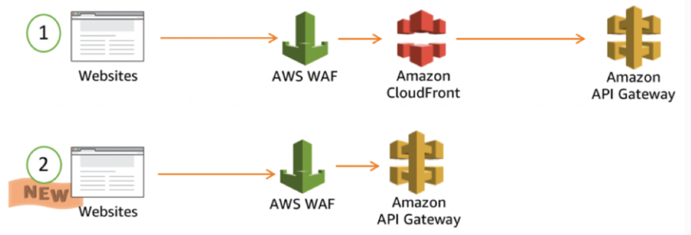

# Security practices and automation

## Amazon Inspector

Is an automated security assessment service that scans EC2 instance and container images for vulnerabilities and deviations from best practices. After performing an assessment, Amazon Inspector produces a detailed list of security findings prioritised by level of severity.

Amazon Inspector security assessment helps check for unintended network accessibility of EC2 instances and for vulnerabilities on those EC2 instances. Assessments are offered as pre-defined rules packages mapped to common security best practices and vulnerability definitions. Examples of built-in rules include checking for access to EC2 instances from the internet, remote root login being enabled, or vulnerable software versions installed.

## AWS Shield

Is a service suited for preventing DDoS attacks on AWS resources. It is available in 2 tiers: Standard and Advanced. AWS Shield Standard is included automatically and transparently in your Elastic Load Balancing load balancers, CloudFront and Route 53 at no additional costs.

## Amazon Macie

Is an ML-powered security service that helps you prevent data loss by automatically discovering, classifying and protecting sensitive data stored in Amazon S3. Macie uses machine learning to recognise sensitive data such as personally identifiable information (PII) or intellectual property. It provides visibility into where this data is stored and how it is being used in your organisation.

## AWS GuardDuty

Is a threat detection service that continuously monitors AWS accounts, workloads and data for malicious activity and unauthorised behaviour. It uses machine learning and threat intelligence. GuardDuty generates a finding whenever it detects unexpected and potentially malicious activity in the AWS environment.

Findings from Amazon GuardDuty can be published to Amazon EventBridge as events that can be used to trigger a Lambda function which will send notifications to the external messaging platform.

Amazon Detective can provide analysis information related to a given finding.

    

## AWS Trusted Advisor

Provides realtime guidance on provisioning resources according to AWS best practices.

It provides a number of checks in 5 major areas:

* Cost optimisation
* Performance
* Security
* Fault tolerance
* Service limits

It has 7 core checks that are free at a basic/developer tier:

* S3 bucket permissions check (not objects)
* Security groups check for ports with unrestricted access
* IAM use
* If root account has MFA enabled
* Checks permissions on EBS public snapshots
* Checks permissions o RDS public snapshots
* Identifies if you are over 80% usage of the 50 most common services

## WAF (Web Application Firewall)

A WAF can protect the following resource types:

* CloudFront distribution
* API Gateway REST API
* Application Load Balancer (ALB)
* AppSync GraphQL API
* Cognito user pool
* App Runner service
* Bedrock AgentCore Gateway
* Verified Access instance
* Amplify

For Amplify and CloudFront, the web ACL protecting a global distribution must be created in the `us-east-1 (N. Virginia)` region. For ALBs, API Gateway and AWS AppSync, the web ACL must match the specific deployment region.

### How it works

WAF lets you control access to your content based on criteria such as IP address.

WAF is the AWS implementation of Layer 7 web application firewall; capable of understanding HTTP(S). It helps protect your web applications from common web exploits that could affect application availability, compromise security, or consume excessive resources.

WAF can protect global services like CloudFront but also regional services like ALB (Application Load Balancer).

Web ACL is associated with a WAF distribution and has Rules and Rule Groups that control how the WAF reacts.

AWS WAF provides control over which traffic to allow or block to a web application by defining customisable web security rules. This includes blocking common attacks like SQL injections or cross-site scripting. New rules can be deployed within minutes.

    

Note that WAF is the first line of defense against web exploits. When WAF is enabled, its rules are evaluated before other access control features such as resource policies, IAM policies, Lambda authorizers and Cognito authorizers. WAF takes precedence over the latter.

### Sending WAF logs to CloudWatch Logs

A CloudWatch Log group needs to be created with the name starting with `aws-waf-logs-`. Logging is then enabled in WAF and the log group is provided as logging destination.

The log group for the WAF protection pack (web ACL) is configured in the same region as the protection pack (web ACL) and using the same account.

This option has the lowest operational overhead but comes at a higher cost. Logs are typically queried using CloudWatch Logs Insights. Automated alerting is easy to integrate based on metric filters.

### Sending WAF logs to an S3 bucket

An S3 bucket needs to be set up from the same account as the protection pack (web ACL). The bucket name for WAF must start with `aws-waf-logs-`. Logging is enabled in WAF and the bucket is provided as destination.

Logs are published to the S3 bucket at 5-minute intervals and the log files are compressed.

This option has the lowest operational overhead and cheapest cost. Logs can be queried using Amazon Athena.

### Sending WAF logs to a Data Firehose stream

A Data Firehose delivery stream is first configured in the same region as the protection pack (web ACL) and then provided as logging destination for WAF using the Firehose HTTPS endpoint. The Data Firehose stream name should start with `aws-waf-logs-`.

This option has medium operational overhead and cost depending on throughput. Firehose also allows data manipulation before ingestion. Tools used to query the logs include Splunk and Datadog.
