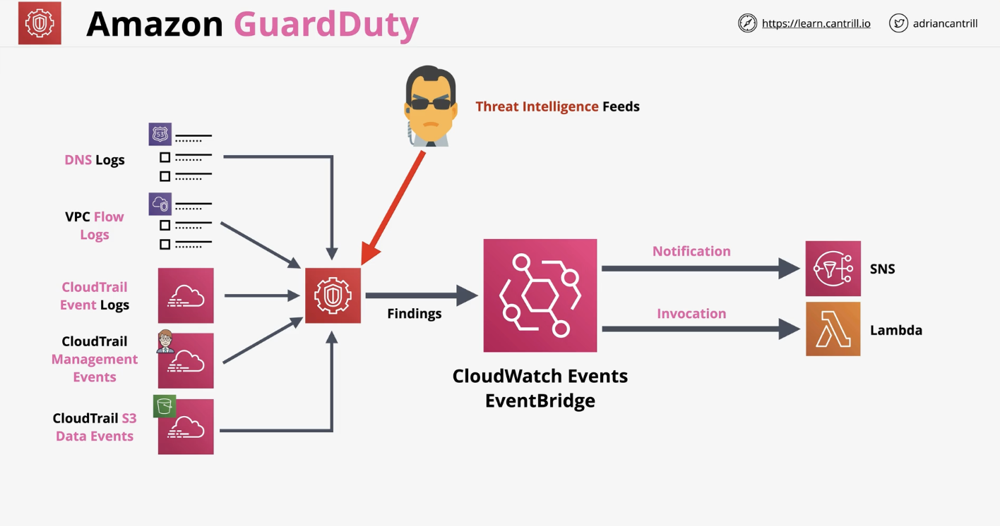

## Patch manager

Concepts:

* Patch Baseline: defines what patches get installed according to operating system and distribution.
* Patch Groups: act as grouping of compute resources i.e. what gets patched.
* Maintenance Windows: is the configuration item used to tie all this together.
* Run Command: `AWS-RunPatchbaseline` is defined within the maintenance window and is used to perform the task on the target group.
* Concurrency and Error Threshold
* Compliance

## AWS Inspector

Is an automated security assessment service that scans EC2 instance and container images for vulnerabilities and deviations from best practices.

## AWS GuardDuty

Is a threat detection service that continuously monitors AWS accounts, workloads and data for malicious activity and unauthorised behaviour. It uses machine learning and threat intelligence.

    

## AWS Trusted Advisor

Provides realtime guidance on provisioning resources according to AWS best practices.

It provides a number of checks in 5 major areas:

* Cost optimisation
* Performance
* Security
* Fault tolerance
* Service limits

It has 7 core checks that are free at a basic/developer tier:

* S3 bucket permissions check (not objects)
* Security groups check for ports with unrestricted access
* IAM use
* If root account has MFA enabled
* Checks permissions on EBS public snapshots
* Checks permissions o RDS public snapshots
* Identifies if you are over 80% usage of the 50 most common services
