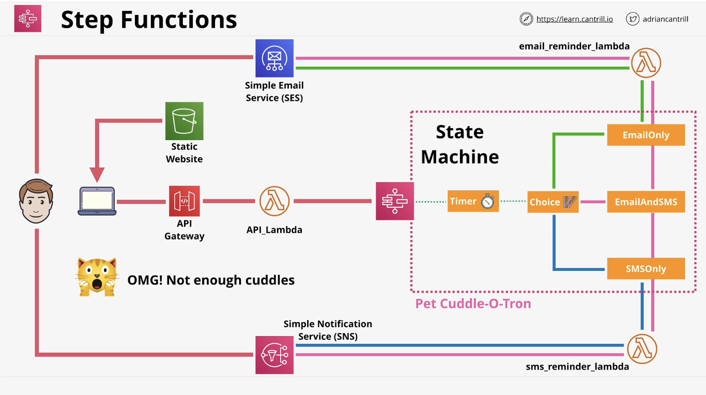

# Step Functions

AWS Step Function is a long-running serverless workflow with a start, state and end. It builds upon the concept of _state machines_. A state machine; which is an abstract concept, has some internal state that can be changed in response to an external event. A state represents a step in the Step function workflow.

Step functions address some of the limitations or design decisions of Lambda functions. Eg. 15 minutes max and stateless runtime. The state machines of a Step function have a max execution duration of 1 year. They can be configured using a JSON template called Amazon States Language (ASL).

In other words, a Step Function lets you coordinate multiple AWS services into serverless workflows. It allows you to design and run workflows that stitch together services such as Lambda, Fargate, etc.

Step functions can have asynchronous and synchronous processes. They can include several steps to form a complete workflow or pipeline.

## 2 types of workflows:

**Standard**: is the default with 1 year execution limit.

**Express**: used for high volume event processing eg. IoT, streaming, etc.

## Example architecture

1. Create a Lambda role. Its Trust Policy is that it can be assumed by the Lambda service. Its Permissions Policy is that it can interact with SES, SNS and States.

2. Create the Lambda function. Select the role created above as execution role. Update the Lambda function code and deploy the function. The Lambda function code sends emails using Python's Boto3 client.

3. Create a role for the state machine. The role's Trust Policy is that it can be assumed by States. The Permissions Policy of the role include being able to invoke Lambda functions as well as `SNS*`.

4. Create the step function i.e. state machine. The state machine's config is ASL. The step function invokes the Lambda function and provides a payload. Give the state machine the role you created for it.

5. Create the supporting Lambda function for the API Gateway.

6. Create the API Gateway. A REST API Gateway. Create a resource -> create a method with integration type "Lambda function". Deploy the API Gateway you created. The API Gateway will have an invoke URL.

    

